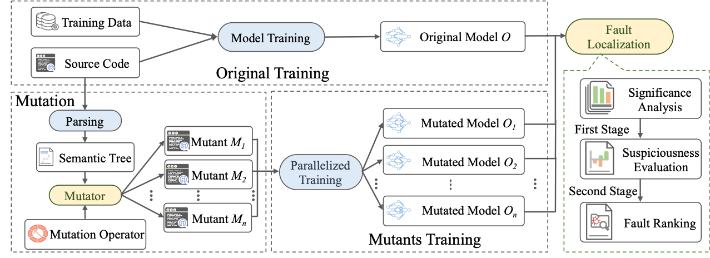

# MuMuFL

MuMuFL: statistical Mutation-based Multiple Fault Localization to locate the faulty statements of a deep learning programs. 

## Overview of MuDLFL



### Step 1: Mutant Generation

After configuring the buggy DL program successfully,  run the tool to be able to get different Mutants.

### Step 2: Fault Localization

After DL mutant generation, MuDLFL will run the DL mutants to evaluate DL mutation behavioral differences as the suspiciousness of a statement being faulty.

## How to use?

### Requirements

- numpy~=1.18.5
- tensorflow~=2.3.0
- tensorflow-gpu~=2.3.0->2.4.1
- Keras~=2.4.3
- matplotlib~=3.3.0
- progressbar~=2.5
- scikit-learn~=0.23.1
- termcolor~=1.1.0
- h5py~=2.10.0
- pandas~=1.1.0
- statsmodels~=0.11.1
- opencv-python~=4.3.0.36
- networkx~=2.5.1
- patsy~=0.5.1
- scipy~=1.4.1

### Environment setup
All the requirements should be installed before run the tool. Please refer requirements37.txt and requirements38.txt for details. For requirements37.txt file, the version of Python should be 3.7. For requirements38.txt file, the version of Python should be 3.8.

The experiments are conducted on Ubuntu 20.04 server with 40 cores of 2.4GHz CPU, 252GB RAM, and two NVIDIA GeForce RTX 3090 GPUs with 24 GB memory.

### Configure the model

Just put the buggyDL model program in the MuDLFL path: `./prepared_model/model_saved.py`

## Project structure

```
├───datasets
├───logs
├───mutated_models
│   └───model
│       ├───results
│       │   └───stats
│       └───results_test
│           └───stats
├───operators
├───prepared_models
├───test_models
├───trained_models
└───utils
    └───properties

```

